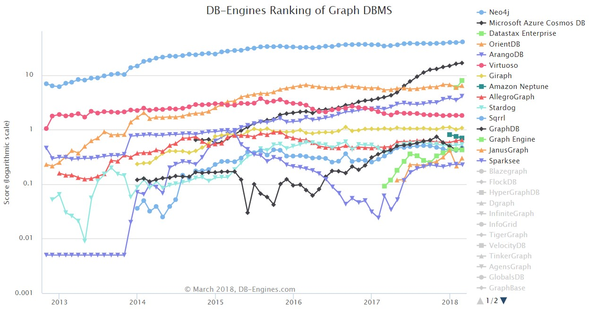
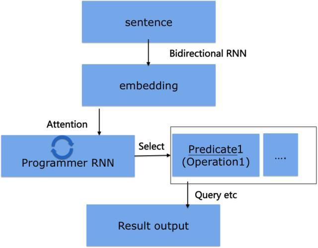

　　知识图谱（Knowledge Graph）于2012年5月17日被Google正式提出，其初衷是为了提高搜索引擎的能力，增强用户的搜索质量以及搜索体验。目前，随着智能信息服务应用的不断发展，知识图谱已被广泛应用于智能搜索、智能问答、个性化推荐等领域。 <!--more-->
　　知识图谱是对物理世界的一种符号表达，其本身是一个具有属性的实体通过关系链接而成的网状知识库，从图的角度来看，知识图谱本质上是一种概念网络，其中的节点表示物理世界中的实体（或概念），而实体之间的各种语义关系则构成网络中的边。知识图谱能够改变现有的信息检索方式，一方面通过推理实现概念检索；另一方面以图形化方式向用户展示经过分类整理的结构化知识，从而使人们从人工过滤数据寻找答案的模式中解脱出来。

　　自从知识图谱被首次提出以来，知识图谱技术成为研究热点，国内多家公司相继发布各自的知识图谱产品，如百度的“知心”、搜狗的“知立方”。2017年7月20日，国务院发布《新一代人工智能发展规划》，其中“跨媒体分析推理技术”是八大关键共性技术之一，这一技术“重点突破跨媒体统一表征、关联理解与知识挖掘、知识图谱构建与学习、知识演化与推理、智能描述与生成等技术，实现跨媒体知识表征、分析、挖掘、推理、演化和利用，构建分析推理引擎”。知识图谱已经成为国家重点研究的技术领域之一，国家电网公司也在知识图谱技术上投入研发力量，构建电力领域的第一张“图谱”。目前，2018年国网科技项目“基于知识图谱的电网全业务统一数据模型关键技术及应用研究”由浙江公司牵头，联合安徽公司、南瑞集团和西安交通大学三家单位开展研究工作，目标是在全业务统一数据中心的数据仓库与数据集市之间构建业务数据知识图谱，建立起语义连接，实现跨业务数据贯通，降低人力成本，减少资源消耗。
　　在本专题中，我们将从实际构建知识图谱的角度详细介绍知识图谱的架构、构建的技术方法和自动更新维护的方法，最后介绍阿里公司在知识图谱应用中的实践经验。

## 知识图谱的架构

　　知识图谱的架构，包括知识图谱自身的逻辑结构以及构建知识图谱所采用的技术（体系）结构。知识图谱的逻辑结构分为两个层次：数据层和模式层。
　　在知识图谱的数据层，知识以事实（fact）为单位存储在图数据库。如果以『实体-关系-实体』或者『实体-属性-值』三元组作为事实的基本表达方式，则存储在图数据库中的所有数据将构成庞大的实体关系网络，形成知识的图谱。
　　模式层在数据层之上，是知识图谱的核心，在模式层存储的是经过提炼的知识，通常采用本体库来管理知识图谱的模式层，借助本体库对公理、规则和约束条件的支持能力来规范实体、关系以及实体的类型和属性等对象之间的联系。本体库在知识图谱中的地位相当于知识库的模具，拥有本体库的知识库冗余知识较少。
　　知识图谱的构建过程是从原始数据出发，采用一系列自动或半自动的技术手段，从原始数据中提取出知识要素（即事实），并将其存入知识库的数据层和模式层的过程。这是一个迭代更新的过程，如下图所示，根据知识获取的逻辑，每一轮迭代包含三个阶段：信息抽取、知识融合以及知识加工。

## 如何构建知识图谱

　　知识图谱的构建主要有自顶向下(Top-Down)和向底向上(Bottom-Up)两种方法。所谓自顶向下的方法是指首先为知识图谱定义数据模式(即为其定义本体)，在定义本体的过程中，首先从最顶层的概念开始，然后逐步进行细化，形成结构良好的分类学层次结构；在定义好数据模式后，再把实体一个个往概念中添加。自底向上的方法则刚好相反，首先从实体开始，对实体进行归纳组织，形成底层的概念，然后逐步往上抽象，形成上层的概念。两种方法在具体的构建过程中通常都不是从零开始的，前者可以利用一些现有的结构化的知识库，有利于抽取新的实例，可保证抽取质量，而后者则可以从开放链接数据或在线百科中得到很多实体，能发现新的模式。目前，大多数知识图谱都采用自底向上的方式进行构建，其中最典型就是Google的Knowledge Vault。

　　采用自底向上的方式构建知识图谱的过程是一个迭代更新的过程，每一轮更新包括3个步骤：
* **信息抽取**，即从各种类型的数据源中提取出实体（概念）、属性以及实体捡的相互关系，在此基础上形成本体化的知识表达
* **知识融合**，在获得新知识后，需要对其进行整合，以消除矛盾和歧义，比如某些实体可能有多种表达，某个特定称谓也许对应于多个不同的实体等
* **知识加工**，对于经过融合的新知识，需要经过质量评估之后（部分需要人工参与甄别），才能将合格的部分加入到知识库中，以确保知识库的质量，新增数据之后，可以进行知识推理、拓展现有知识、得到新知识。

### 信息抽取
　　信息抽取是知识图谱构建的第一步，其中的关键问题是如何从异构数据源中自动抽取信息得到候选知识单元。信息抽取是一种自动化地从半结构化和无结构数据中抽取实体、关系以及实体属性等结构化信息的技术。涉及的关键技术包括：命名实体识别、关系抽取和属性抽取。

#### 命名实体识别
　　命名实体识别（named entity recognition，NER）也称实体抽取，是指从文本数据集中自动识别出命名实体。实体抽取的质量（准确率和召回率）对后续的知识获取效率和质量影响极大，因此是信息抽取中最为基础和关键的部分。2012年Ling等人归纳出112种实体类别，并基于条件随机场CRF进行实体边界识别，最后采用自适应感知机算法实现了对实体的自动分类，取得了不错的效果。
　　但是随着互联网中内容的动态变化，采用人工预定义实体分类体系的方式已经很难适应时代的需求，因此提出了面向开放域的实体识别和分类研究。
　　在面向开放域的实体识别和分类研究中，不需要（也不可能）为每个领域或者每个实体类别建立单独的语料库作为训练集。因此，该领域面临的主要挑战是如何从给定的少量实体实例中自动发现具有区分力的模型。
　　一种思路是根据已知的实体实例进行特征建模，利用该模型处理海量数据集得到新的命名实体列表，然后针对新实体建模，迭代地生成实体标注语料库。另一种思路是利用搜索引擎的服务器日志，事先并不给出实体分类等信息，而是基于实体的语义特征从搜索日志中识别出命名实体，然后采用聚类算法对识别出的实体对象进行聚类。

#### 关系抽取
　　文本语料经过实体抽取，得到的是一系列离散的命名实体，为了得到语义信息，还需要从相关的语料中提取出实体之间的关联关系，通过关联关系将实体联系起来，才能够形成网状的知识结构，研究关系抽取技术的目的，就是解决如何从文本语料中抽取实体间的关系这一基本问题。
　　早期的关系抽取研究方法主要是通过人工构造语法和语义规则。随后，出现了大量基于特征向量或者核函数的有监督学习方法，关系抽取的准确性也不断提高。但以上研究成果的共同特点是需要预先定义实体关系类型，如雇佣关系、整体部分关系以及位置关系等。
　　与之相对的，Banko等人提出了面向开放域的信息抽取方法框架，并发布了基于自监督学习方式的开放信息抽取原型系统TextRunner，该系统采用少量人工标记数据作为训练集，据此得到一个实体关系分类模型，再依据该模型对开放数据进行分类，依据分类结果训练朴素贝叶斯模型来识别『实体-关系-实体』三元组，经过大规模真实数据测试，取得了显著优于同时期其他方法的结果。
　　TextRunner系统中错误的部分主要是一些无意义或者不和逻辑的实体关系三元组，据此引入语法限制条件和字典约束，采用先识别关系指示词，然后再对实体进行识别的策略，有效提高了关系识别准确率。

#### 属性抽取
　　属性抽取的目标是从不同信息源中采集特定实体的属性信息。例如针对某个公众人物，可以从网络公开信息中得到其昵称、生日、国籍、教育背景等信息。属性抽取技术能够从多种数据来源中汇集这些信息，实现对实体属性的完整勾画。
　　由于可以将实体的属性视为实体与属性值之间的一种名词性关系，因此也可以将属性抽取问题视为关系抽取问题。
　　百科类网站提供的半结构化数据是当前实体属性抽取研究的主要数据来源。但是还有大量的实体属性数据隐藏在非结构化的公开数据中。
　　一种解决方案是基于百科类网站的半结构化数据，通过自动抽取生成训练语料，用于训练实体属性标注模型，然后将其应用于对非结构化数据的实体属性抽取；另一种方案是采用数据挖掘的方法直接从文本中挖掘实体属性与属性值之间的关系模式，据此实现对属性名和属性值在文本中的定位。这种方法的基本假设是属性名和属性值之间在位置上有关联关系，事实上在真实语言环境中，许多实体属性值附近都存在一些用于限制和界定该属性值含义的关键词（属性名），在自然语言处理技术中将这类属性称为有名属性，因此可以利用这些关键字来定位有名属性的属性值。

### 知识融合
通过信息抽取，实现了从非结构化和半结构化数据中获取实体、关系以及实体属性信息的目标，然而，这些结果中可能包含大量的冗余和错误信息，数据之间的关系也是扁平化的，缺乏层次性和逻辑性，因此有必要对其进行清理和整合。知识融合包含两部分内容：实体链接和知识合并。

#### 实体链接
　　实体链接（entity linking）是指对于从文本中抽取得到的实体对象，将其链接到知识库中对应的正确实体对象的操作。
　　实体链接的一般流程是：
　　从文本中通过实体抽取得到实体指称项进行实体消歧和共指消解，判断知识库中的同名实体与之是否代表不同的含义，以及知识库中是否存在其他命名实体与之表示相同的含义。在确认知识库中对应正确实体对象之后，将该实体指称链接到知识库中对应实体。

#### 实体消歧
　　实体消歧是专门用于解决同名实体产生歧义问题的技术，通过实体消歧，就可以根据当前的语境，准确建立实体链接，实体消歧主要采用聚类法。其实也可以看做基于上下文的分类问题，类似于词性消歧和词义消歧。
　　共指消解技术主要用于解决多个指称对应同一实体对象的问题。在一次会话中，多个指称可能指向的是同一实体对象。利用共指消解技术，可以将这些指称项关联（合并）到正确的实体对象，由于该问题在信息检索和自然语言处理等领域具有特殊的重要性，吸引了大量的研究努力。共指消解还有一些其他的名字，比如对象对齐、实体匹配和实体同义。

### 知识合并
　　在构建知识图谱时，可以从第三方知识库产品或已有结构化数据获取知识输入。常见的知识合并需求有两个，一个是合并外部知识库，另一个是合并关系数据库。将外部知识库融合到本地知识库需要处理两个层面的问题：
* 数据层的融合，包括实体的指称、属性、关系以及所属类别等，主要的问题是如何避免实例以及关系的冲突问题，造成不必要的冗余；
* 通过模式层的融合，将新得到的本体融入已有的本体库中。

　　然后是合并关系数据库，在知识图谱构建过程中，一个重要的高质量知识来源是企业或者机构自己的关系数据库。为了将这些结构化的历史数据融入到知识图谱中，可以采用资源描述框架（RDF）作为数据模型。业界和学术界将这一数据转换过程形象地称为RDB2RDF，其实质就是将关系数据库的数据换成RDF的三元组数据。

### 知识加工
　　通过信息抽取，可以从原始语料中提取出实体、关系与属性等知识要素，再经过知识融合，可以消除实体指称项与实体对象之间的歧义，得到一系列基本的事实表达。然而事实本身并不等于知识，要想最终获得结构化，网络化的知识体系，还需要经历知识加工的过程。知识加工主要包括3方面内容：本体构建、知识推理和质量评估。

#### 本体构建
　　本体（ontology）是对概念进行建模的规范，是描述客观世界的抽象模型，以形式化的方式对概念及其之间的联系给出明确定义。本体最大的特点在于它是共享的，本体反映的知识是一种明确定义的共识。
　　本体是同一领域内的不同主体之间进行交流的语义基础。本体是树状结构，相邻层次的节点（概念）之间有严格的『IsA』关系。在知识图谱中，本体位于模式层，用于描述概念层次体系，是知识库中知识的概念模板。
　　本体可以采用人工编辑的方式手动构建（借助本体编辑软件），也可以以数据驱动的自动化方式构建本体，其包含3个阶段：实体并列关系相似度计算、实体上下位关系抽取以及本体的生成。
　　实体并列关系相似度适用于考察任意给定的两个实体在多大程度上属于同一概念分类的指标测度，相似度越高，表明这2个实体越有可能属于同一语义类别。所谓并列关系，是相对于纵向的概念隶属关系而言的。
　　实体上下位关系抽取是用于确定概念之间的隶属（IsA）关系，这种关系也称为上下位关系。
　　本体生成阶段的主要任务是对各层次得到的概念进行聚类，并对其进行语义类的标定（为该类的中的实体指定1个或多个公共上位词）。
　　当前主流的实体并列关系相似度计算方法有两种：模式匹配法和分布相似度。其中，模式匹配法采用预先定义实体对模式的方法，通过模式匹配取得给定关键字组合在同一语料单位中共同出现的频率，据此计算实体对之间的相似度。分布相似度方法的前提假设是：在相似的上下文管径中频繁出现的实体之间具有语义上的相似性。
　　实体上下位关系抽取是该领域的研究重点，主要的研究方法是基于语法模式（如Hearst模式）抽取IsA实体对。也有方法利用概率模型判定IsA关系和区分上下位词，通常会借助百科类网站提供的概念分类知识来帮助训练模型，以提高算法精度。

#### 知识推理
　　知识推理是指从知识库中已有的实体关系数据出发，进行计算机推理，建立实体间的新关联，从而拓展和丰富知识网络。知识推理是知识图谱构建的重要手段和关键环节，通过知识推理，能够从现有知识中发现新的知识。
　　知识推理的对象也并不局限于实体间的关系，也可以是实体的属性值，本体的概念层次关系等。知识的推理方法可以分为2大类：基于逻辑的推理和基于图的推理。
　　基于逻辑的推理主要包括一阶逻辑谓词、描述逻辑以及基于规则的推理。一阶谓词逻辑建立在命题的基础上，在一阶谓词逻辑中，命题被分解为个体和谓词两部分。个体是指可独立存在的客体，可以是一个具体的事物，也可以是一个抽象的概念。谓词是用来刻画个体性质及事物关系的词。比如（A，friend，B）就是表达个体A和B关系的谓词。
　　对于复杂的实体关系，可以采用描述逻辑进行推理。描述逻辑（description logic）是一种基于对象的知识表示的形式化工具，是一阶谓词逻辑的子集，它是本体语言推理的重要设计基础。
　　基于规则的推理可以利用专门的规则语言，如SWRL（semantic web rule language）。基于图的推理方法主要基于神经网络模型或Path Ranking算法。Path Ranking算法的基本思想是将知识图谱视为图（以实体为节点，以关系或属性为边），从源节点开始，在图上执行随机游走，如果能够通过一个路径到达目标节点，则推测源和目的节点可能存在关系。

#### 质量评估
　　质量评估也是知识库构建技术的重要组成部分。其意义在于：可以对知识的可信度进行量化，通过舍弃置信度较低的知识，可以保障知识库的质量。

### 通用知识图谱和行业知识图谱构建的区别
　　通用知识图谱和行业知识图谱的区别主要体现在覆盖面和使用方式上，这些区别也在一定程度上决定了两类知识图谱构建方法的不同。由于通用知识图谱在覆盖面方面要求高，因此强调更多的是实体，通常以自底向上的方式来构建;而行业知识图谱同时也注重概念之间的体系结构，因此在构建时通常会使用自顶向下和自底向上两种方式相结合的方式。
　　另一方面，由于行业知识图谱的专业性要求更高，所以通常需要使用特定的行业数据来源；因此，行业知识图谱在构建时，通常以结构化的关系数据库中热信息为起点，进而扩展到非结构化数据。
　　对于行业知识图谱的构建，行业的内部结构化数据以及一些开放的行业知识库或行业垂直网站会起非常关键的作用。这些行业数据源由于与行业业务结合紧密，因此通常具有如下优点：
　　（1）具备良好的行业覆盖面和行业深度，行业数据由于描述目标的专一性，通常在行业内部的覆盖面方面会比较广，通常包含所描述行业的大多数信息，例如IMDB是互联网的数据集中拥有最全电影信息的网站。
　　（2）可靠性高：对于行业的内部结构化数据，通常情况下用于支撑企业本身的业务，因此可靠性非常高;对于开放的行业知识库数据，有些是企业的结构数据经过一定形式的转化发布到网上的，而有些则是经过行业专业人员的编辑和审核后发布到网上的，因此，可靠性也可以得到保证。
　　（3）结构性强：对于内部结构化数据，绝大多数是通过关系数据库进行存储的；而对于开放的行业知识库，通常是以网页的形式使用同样的模板生成的，因而结构基本相同，解析非常方便。

　　因此，在进行行业知识图谱构建时，会优先考虑使用行业中的内部结构化数据和开放的行业知识库。

## 如何维护知识图谱

　　知识图谱的目标是构建一个能够刻画现实世界的知识库，为自动问答、信息检索等应用提供支撑。因此，对知识的持久化存储并提供对目标知识的高效检索是合格的知识图谱必须具备的基本功能。

### 知识图谱的存储
　　按照存储方式的不同，知识图谱的存储可以分为基于表结构的存储和基于图结构的存储。基于表结构的存储利用二维的数据表对知识图谱中的数据进行存储，通常包括：三元组表、类型表、关系数据库等；基于图结构的存储利用图数据库对知识图谱中的数据进行存储。下面将分别介绍这几种存储方式的优缺点。

#### 三元组表
　　基于三元组表的存储方式的优点是简单直接，易于理解；然而缺点也非常明显，主要有以下两点：
　　（1）整个知识图谱都存储在一张表中，导致单表的规模太大。对大表进行查询、插入、删除、修改等操作的开销很大，这将导致知识图谱的实用性大打折扣。
　　（2）复杂查询在这种存储结构上的开销巨大。由于数据表只包括三个字段，因此复杂的查询只能拆分成若干简单查询的复合操作，大大降低了查询的效率。例如，查询“佩佩的身高和性别是什么？”需要拆分为“佩佩的身高是多少？”和“佩佩的性别是什么？”

#### 类型表
　　类型表为每种类型构建一张表，同一类型的实例存放在相同的表中。表的每一列表示该类实体的一个属性，每一行存储该类实体的一个实例。
　　类型表克服了三元组表面临的单表过大和结构简单的问题，但是也有明显的不足之处：
　　（1）由于数据表是和具体类型对应的，不同的数据表具有不同的结构，因此在查询之前必须知道目标对象的类型才能确定查找的数据表。
　　（2）当查询涉及到不同类型的实体时，需要进行多表的连接，这一操作开销巨大，限制了知识图谱对复杂查询的处理能力。
　　（3）知识图谱通常包含丰富的实体类型，因此需要创建大量的数据表，并且这些数据表之间又具有复杂的关系，这为数据的管理增加了很大的难度。

#### 关系数据库
　　关系数据库以二维表结构对数据进行组织和存储，如果选择关系数据库作为知识图谱的存储引擎，那么对知识图谱的所有操作都需要转换为SQL语句才能执行。

#### 图数据库
　　图数据库基于有向图，其理论基础是图论。知识图谱将实体看做节点，关系看做带有标签的边，那么知识图谱的数据很自然地满足图模型结构。节点、边和属性是图数据库的核心概念。

　　**节点**：节点用于表示实体、事件等对象，可以类比于关系数据库中的记录或数据表中的行数据。例如人物、地点、电影等都可以作为图中的节点。
　　**边**：边是指图中连接节点的有向线条，用于表示不同节点之间的关系。例如人物节点之间的夫妻关系、同事关系等都可以作为图中的边。
　　**属性**：属性用于描述节点或者边的特性。例如人物的姓名、夫妻关系的起止时间等都是属性。

　　下图是[DB-Engines](https://db-engines.com/en/ranking_trend/graph+dbms)上最新一期（截至2018年3月）的图数据库得分排名，从中可以看出Neo4j在整个图存储领域里占据着NO.1的地位。

　　**Neo4j**：是一个开源的图数据库系统，它将结构化的数据存储在图上而不是表中。Neo4j基于Java实现，它是一个具备完全事务特性的高性能数据库，具有成熟数据库的所有特性。Neo4j是一个本地数据库（又称基于文件的数据库），这意味着不需要启动数据库服务器，应用程序不用通过网络访问数据库服务，而是直接在本地对其进行操作，因此访问速度快。因其开源、高性能、轻量级等优势，Neo4j 受到越来越多的关注。
　　**OrientDB**：是一个开源的文档-图混合数据库，兼具图数据库对数据强大的表示及组织能力和文档数据库的灵活性及很好的可扩展性。OrientDB具有多种模式可选，包括全模式、无模式和混合模式。全模式要求数据库中的所有类别都必须有严格的模式，所有字段都强制约束；无模式则相反，不需要为类别定义模式，存储的数据记录可以有任意的字段；混合模式则允许为类别定义若干字段，同时支持自定义字段。该数据库同样是本地的，支持许多数据库的高级特性，如事务、快速索引、SQL查询等。
　　**HyperGraphDB**：是开源的存储系统，并依托于BerkeleyDB数据库。和上述图数据库相比，HyperGraphDB最大的特点在于HyperGraph，即超图。从数学角度讲，有向图的一条边只能指向一个节点，而超图则可以指向多个节点。实际上，HyperGraphDB在超图的基础上更进了一步，不仅允许一条边指向多个节点，还允许其指向其它边。如此以来，HyperGraphDB相较于其它图数据库具有更强大的表示能力。
　　**InfiniteGraph**：是一个基于Java语言开发的分布式图数据库系统，它的目标是构建“分布式的图形数据库”，已被美国国防部和美国中央情报局所采用。和MySQL等传统关系数据库类似，InfiniteGraph需要作为服务项目进行安装，应用程序只能通过访问数据库服务对数据库进行操作。InfiniteGraph借鉴了面向对象的概念，将图中的每个节点及每条边都看做一个对象。具体地，所有的节点都继承自基类BaseVertex，所有的边则都继承自基类BaseEdge。
　　**InfoGrid**：是一个开源的互联网图数据库，提供了很多额外的组件，可以很方便地构建基于图结构的网络应用。InfoGrid实际上是一个基于Java语言的开源项目集，其中InfoGrid图数据库项目是其核心，其它的项目包括InfoGrid存储项目、InfoGrid用户接口项目等。
　　和成熟的关系数据库相比，图数据库的发展较晚，相关的标准及技术尚不完善，在实际使用中可能会遇到一些棘手的问题，因此在选用数据库时除了需要考虑数据库本身的特性、性能等因素以外，还需要考虑数据库的易用性、技术文档的完整性等因素。

### 知识图谱的数据更新
　　知识图谱的构建并非一促而就，它是一个不断改进和优化的过程。当数据源有更新或学习的方法有更新时，不可避免地要对知识图谱进行更新。知识图谱的更新主要分为两个层面的更新，数据模式层的更新和数据层的更新。
　　数据模式层的更新是指知识图谱本体中元素的变更，包括概念的增加、修改和删除，概念之间上下位关系的更新，以及概念属性的更新;其中最重要的更新是概念属性的更新，因为概念属性的更新操作会影响到所有直接和间接属性它的子概念和实体。因此，在通常情况下，知识图谱数据模式层的更新的处理会相当谨慎，尤其涉及数据模式的冲突和删除时;这些时候，数据模式的更新通常是在人工干预下进行的。
　　数据层的更新即指实体数据的更新，包括添加和删除实体，修改实体的基本信息和属性值。数据层的更新一般影响面小，因此通常以自动的方式完成。加入到知识图谱中的数据不是一成不变的，知识类型对应的实例往往动态变化。例如，搜索引擎公司利用其强大的计算保证图谱每天的更新在3个小时内完成，而实时的热点也能保证在事件发生6个小时内在搜索结果中反映出来。
　　为了保证其质量，知识图谱模式是由专业团队审核和维护的。以谷歌知识图谱为例，目前定义的类别数约为$10^3$~$10^4$量级。为了提高知识图谱的覆盖率，搜索引擎公司还通过自动化算法从各种数据源抽取新的类型信息（也包含关联的属性或关系信息）。这些信息并不是被马上加入到知识图谱模式中的。某一种类型若要长期保留，则要在发展到一定程度后，由专业的人员进行决策和命名，这样才能最终成为一种新的类型。
　　对于构建的知识图谱，除了需要内部专业团队进行审核和维护，还要依靠用户来帮助改善。具体来说，用户可以对搜索结果中展现的知识卡片所列出的实体相关的事实进行纠错。当很多用户都指出某个错误时，搜索引擎将采纳并修正。这种利用群体智慧的协同式知识编辑是对专业团队集中式管理的互补。

## 行业动态：阿里知识图谱

　　借助阿里知识图谱的建设，阿里电商平台管控从过去的“巡检”模式升级为发布端实时逐一检查。在海量的商品发布量的挑战下，最大可能地借助大数据、人工智能阻止坏人、问题商品进入阿里生态。同时面临问题商家实时的对弈、变异和恶意攻击等诸多挑战，知识图谱仍然保持着每天千万级别的拦截量，亿级别的全量智能审核次数，在滥发、侵权、合规、假货、经营范围等多个场景全面与问题卖家正面交锋，实时对弈。为了最大限度地保护知识产权，保护消费者权益，阿里对知识图谱推理引擎技术提出了智能化、自学习、毫秒级响应、可解释等更高地技术要求，实现良好的社会效益。
　　阿里巴巴生态里积累了海量的商品数据，这些宝贵的商品数据来自于淘宝、天猫、1688、AliExpress等多个市场，同时品牌商、行业运营、治理运营、消费者、国家机构、物流商等多种角色参与其中，贡献着这样一个庞大的商品库。无论是知识产权保护，还是提升消费者购物体验，实现商品数据的标准化（商品规范的统一和商品信息的确定性）, 以及与内外部数据之间的深度互联，意义都非常重大，阿里商品知识图谱承载着商品标准化这一基础性，根源性的工作。基于此才能知道哪些商品是同样一件产品，一个品牌是否被授权，品牌下的产品卖到了哪些市场。
　　阿里知识图谱以商品、标准产品、标准品牌、标准条码、标准分类为核心，利用实体识别、实体链指和语义分析技术，整合关联了例如舆情、百科、国家行业标准等9大类一级本体，包含了百亿级别的三元组，形成了巨大的知识网。
　　阿里知识图谱综合利用前沿的NLP、语义推理和深度学习等技术，打造全网商品智能服务体系，服务阿里生态中的各个角色。商品知识图谱广泛地应用于搜索、前端导购、平台治理、智能问答、品牌商运营等核心、创新业务。能够帮助品牌商透视全局数据，帮助平台治理运营发现问题商品，帮助行业基于确定的信息选品，做人货场匹配提高消费者购物体验等等。为新零售、国际化提供可靠的智能引擎。

### 引入机器学习算法搭建推理引擎
　　阿里设计了一套框架来实现知识表示和推理。此外，知识图谱实体、关系、词林（同义词、上下位词）、垂直知识图谱（例如地理位置图谱、材质图谱）、机器学习算法模型等都纳入进来做统一的描述。
　　按照不同场景，我们把推理分为：上下位和等价推理，不一致性推理，知识发现推理，本体概念推理等。例如：
　　1. 上下位和等价推理。检索父类时，通过上下位推理把子类的对象召回，同时利用等价推理（实体的同义词、变异词、同款模型等），扩大召回。 例如，为保护消费者我们需要拦截“产地为某核污染区域的食品”，推理引擎翻译为“找到产地为该区域，且属性项与“产地”同义，属性值是该区域下位实体的食品，以及与命中的食品是同款的食品”。
　　2. 不一致推理。在与问题卖家对弈过程中，我们需要对商品标题、属性、图片、商品资质、卖家资质中的品牌、材质、成分等基础信息，做一致性校验。比如说标题中的品牌是Nike而属性或者吊牌中品牌是Nake，如下图所示，左边描述了商品标题、属性、吊牌上的品牌信息是一致的，推理为一致。右边为吊牌和商品品牌不一致的商品，被推理引擎判断为有问题的商品。。 
　　3. 知识发现推理。一致性推理的目的是确保信息的确定性，例如通过一致性推理我们能确保数据覆盖到的食品配料表正确。但消费者购物时很少看配料表那些繁杂的数字。消费者真正关心的是无糖、无盐等强感知的知识点。为了提高消费者购物体验，知识发现推理通过底层配料表数据和国家行业标准例如：
　　无糖：碳水化合物≤ 0.5g/100g（固体）或100mL（液体）
　　无盐：钠≤5mg/100g或100mL
　　我们可以把配料表数据转化为“无糖”、“无盐”等知识点。从而真正地把数据变成了知识。通过AB test验证，类似知识点在前端导购中极大地改善了消费者购物体验。

### 推理引擎背后技术框架

　　首先，推理引擎把自然语言通过语义解析(semantic parsing)转换为逻辑表达式(logical form)。语义解析采用了结合神经网络和符号逻辑执行的方式：自然语言经过句法、语法分析、NER、Entity Linking，被编码为分布式表示(distributed representation)，句子的分布式表示被进一步转义为逻辑表达式。

　　在分布式表示转换为逻辑表达式的过程中，首先面临表示和谓词逻辑操作之间映射的问题。把谓词当做动作，通过训练执行symbolic operation，类似neural programmer中利用attention机制选择合适的操作，即选择最有可能的谓词操作，最后根据分析的句法等把谓词操作拼接为可能的逻辑表达式， 再把逻辑表达式转换为查询等。过程示意如下图所示。

　　其次，逻辑表达式会触发后续的逻辑推理和图推理。逻辑表达式在设计过程中遵循以下几个原则：逻辑表达式接近人的自然语言，同时便于机器和人的理解。表达能力满足知识图谱数据、知识表示的要求。应该易于扩展，能够非常方便的增加新的类、实体和关系，能够支持多种逻辑语言和体系，如Datalog、OWL等，即这些语言及其背后的算法模块是可插拔的，通过可插拔的功能，推理引擎有能力描述不同的逻辑体系。
　　阿里知识图谱经过三年的建设，已经形成了巨大的知识图谱和海量的标准数据，引入了前沿的自然语言处理、知识表示和逻辑推理技术，在阿里巴巴新零售、国际化战略下发挥着越来越重要的作用。
